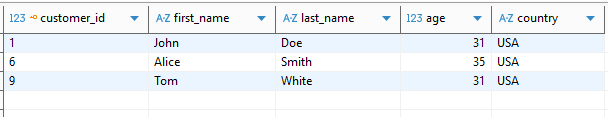

Часть 1: WHERE 
Задача 1 Найдите всех клиентов из страны 'USA', которым больше 25 лет.

```sql
SELECT 
       customer_id,
       first_name,
       last_name,
       age,
       country
FROM 
       Customers 
WHERE 
       age > 25   --Фильтр по возрасту
AND 
       country ='USA';  --Фильтр по стране
```



Задача 2 Выведите все заказы, у которых сумма (amount) больше 1000.

```sql
SELECT 
       order_id,
       item,
       amount,
       customer_id
FROM 
       Orders
WHERE
       amount > 1000;  --Фильтр по сумме
```

 

Часть 2: JOIN 
Задача 1 Получите список заказов вместе с именем клиента, который сделал заказ.

```sql
SELECT 
       Customers.first_name, 
       Customers.last_name, 
       Orders.item, 
       Orders.amount  
FROM 
       Customers
JOIN 
       Orders
ON 
       Customers.customer_id = Orders.customer_id  --Связь по customer_id
```


 

Задача 2 Выведите список доставок со статусом и именем клиента.

```sql
SELECT 
       Shippings.status,
       Customers.first_name , 
       Customers.last_name  
FROM 
       Shippings
JOIN
       Customers
ON 
       Shippings.customer = Customers.customer_id  --Связь по customer_id
```


 

Часть 3: GROUP BY 
Задача 1 Подсчитайте количество клиентов в каждой стране.

```sql
SELECT 
       country,  
       COUNT(customer_id) AS customer_count  --Подсчет количества клиентов
FROM 
       Customers
GROUP BY
       country
ORDER BY 
       country DESC                --Сортировка по стране (Z-A)
```


 

Задача 2 Посчитайте общее количество заказов и среднюю сумму по каждому товару.

```sql
SELECT 
       item,
       COUNT(order_id) AS total_orders,      --Количество заказов
       AVG(amount) AS average_amount  --Средняя сумма
FROM 
       Orders
GROUP BY
       item
ORDER BY 
       average_amount  DESC           --Сортировка по средней сумме (убывание)
```

 
 

Часть 4: ORDER BY
 Задача 1 Выведите список клиентов, отсортированный по возрасту по убыванию.

```sql
SELECT 
       first_name,
       age
FROM 
       Customers
ORDER BY 
       age  DESC    --сортировка по возрасту (убывание)
```

 

Часть 5: SUBQUERIES
 Задача 1 Найдите всех клиентов, которые сделали заказ с максимальной суммой.

```sql
SELECT 
      Customers.first_name,
      Customers.last_name, 
      Orders.amount    
FROM  
      Customers
JOIN
       Orders 
ON   
      Customers.customer_id = Orders.customer_id
WHERE 
      Orders.amount = (    --Подзапрос для поиска max суммы
                       SELECT 
                             MAX(amount) 
                       FROM 
                             Orders
                       )
```


 

Часть 6: WINDOW FUNCTIONS
 Задача 1 Для каждого заказа добавьте колонку с суммой всех заказов этого клиента (используя оконную функцию).

```sql
SELECT 
       order_id,
       customer_id,
       item,
       amount,
       --Оконная функция (сумма всех заказов этого клиента)
       SUM(amount)OVER(PARTITION BY customer_id) AS total_by_customer  
FROM 
       Orders
ORDER BY                  --сортировка по order_id
       order_id    
```


 


Часть 7 (Опционально) 
Найдите клиентов, которые:
1. Сделали хотя бы 2 заказа (любых), 
2. Имеют хотя бы одну доставку со статусом 'Delivered'. 
Для каждого такого клиента выведите: 
● full_name (имя + фамилия),
● общее количество заказов, 
● общую сумму заказов, 
● страну проживания.

вариант 1 Использование подзапросов 

```sql
SELECT 
       CONCAT(Customers.first_name, ' ', Customers.last_name) AS full_name,
       Customers.country,
       --Считаем заказы  клиента
       (SELECT COUNT(DISTINCT order_id) 
       FROM  Orders 
       WHERE Customers.customer_id = customer_id ) AS total_orders,
       --Сумма заказов  клиента
       (SELECT SUM(amount) 
       FROM  Orders 
       WHERE Customers.customer_id = customer_id) AS total_amount       
FROM 
       Customers
  WHERE                                   --Фильтрация клиентов с >= 2 заказами
       (SELECT COUNT(DISTINCT order_id) 
       FROM  Orders 
       WHERE Customers.customer_id = customer_id ) >= 2  
 AND EXISTS                               --Проверка доставки 'Delivered'
       (SELECT 1 
       FROM  Shippings 
       WHERE customer = Customers.customer_id AND status = 'Delivered')
```

вариант 2 Использование CTE

```sql
WITH customer_order_stats AS (  --CTE для клиентов с >= 2 заказами 
                    SELECT 
                          customer_id,
                          COUNT (DISTINCT order_id) AS total_order,
                          SUM (amount) AS total_amount
                    FROM  Orders o
                    GROUP BY customer_id 
                    HAVING COUNT (DISTINCT order_id) >= 2
                    ),
     delivered_customers AS (  --CTE для клиентов со статусом "Delivered"
                    SELECT customer  
                    FROM Shippings 
                    WHERE status = 'Delivered'
                    )                           
     SELECT 
           CONCAT(c.first_name, ' ', c.last_name) AS full_name,
            c.country,
            s.total_order,
            s.total_amount
     FROM  Customers c
     JOIN customer_order_stats s ON c.customer_id = s.customer_id
     JOIN delivered_customers d ON c.customer_id = d.customer
                      
```

 
